# Kagi Labs 🟡🛡️

Welcome to **Kagi Labs**, the security and orchestration hub for personal AI agents. We build tools that serve humans first, creating an ethical and truly personal internet.

## 🗺️ System Ecosystem

This diagram illustrates how Kagi Labs software bridges the gap between your local devices and the agentic services.

```mermaid
graph TD
    User([User / Laptop]) <-->|Orders & Approvals| Minato
    
    subgraph OpenClaw Server
        Minato{⚓ Minato Orchestrator} -->|Delegate Task| Hashi[🪵 Hashi Delegation Engine]
        Hashi -->|Tool Call| Aegis{🛡️ Aegis Security}
        Aegis -->|MITM Proxy| Target[Real MCP Server / CLI]
        
        Hashi <-->|Sync Memory| Kura[(🏯 Kura Storehouse)]
        Minato <-->|Archive Logs| Kura
    end

    Aegis -->|Approval Req| Minato
    Minato -->|Discord / Telegram / Web| User
```

## 🚀 Active Projects

### [Minato](https://github.com/kagi-labs/minato) ⚓
The **Orchestration Hub**. Minato is the central brain for communication and coordination. It provides "Channel-as-a-Service" (Discord, Telegram, Web), manages live session streaming, and orchestrates the flow of orders from the user to the underlying agents.

### [Hashi](https://github.com/kagi-labs/hashi) 🪵
The **Delegation Engine**. A local-first worker written in Go. Hashi acts as the execution layer where tasks are delegated. It is designed to give users more secure, powerful AI capabilities on their local workmachines by managing the full lifecycle of tools, MCP servers, and CLIs to fulfill specific technical instructions.

### [Aegis](https://github.com/kagi-labs/aegis) 🛡️
The **Security Control Plane**. A Universal MITM proxy for AI Agents. It provides human-in-the-loop approvals, skill auditing, and static analysis to ensure every tool call is safe.

### [Kura](https://github.com/kagi-labs/kura) 🏯
The **Persistent Storehouse**. A local-first storage abstraction layer with S3-compatible interfaces. Designed to eliminate "sync hacks" by providing reliable infrastructure for agent memory and artifacts.

---
*Built by BMO for Oles.* 🤖💚
