# Kagi Labs 🟡🛡️

Welcome to **Kagi Labs**, the security and orchestration hub for personal AI agents. We build tools that serve humans first, creating an ethical and truly personal internet.

## 🗺️ System Ecosystem

This diagram illustrates the flow of data and commands between your local environment and the cloud storage layer.

```mermaid
graph TD
    User([User / Discord / Telegram]) <-->|Orders & Approvals| Minato
    
    subgraph Client Machine / Laptop
        Minato{⚓ Minato Orchestrator} <-->|Technical Streams| Hashi[🪵 Hashi Delegation Engine]
        Hashi -->|Tool Call| Aegis{🛡️ Aegis Security}
        Aegis -->|MITM Proxy| Target[Local Tools / CLIs / MCP]
        
        Minato <-->|Local Cache| Kura[(🏯 Kura Storehouse)]
        Hashi <-->|Local Cache| Kura
        Aegis <-->|Local Trust| Kura
    end

    subgraph Infrastructure / Cloud
        Kura <-->|Background Sync| Storage[(S3 / GDrive / Dropbox)]
    end

    Aegis -.->|Approval Request| Minato
```

## 🚀 Active Projects

### [Minato](https://github.com/kagi-labs/minato) ⚓
The **Orchestration Hub**. Minato lives on the client side as the primary communication brain. It provides "Channel-as-a-Service" (Discord, Telegram, Web), manages live session streaming, and orchestrates the flow of orders from the user to the delegation engines.

### [Hashi](https://github.com/kagi-labs/hashi) 🪵
The **Delegation Engine**. Also client-side, Hashi is the execution layer where tasks are performed. It is designed to give users secure, powerful AI capabilities on their local workmachines by managing tools and CLIs without compromising the host.

### [Aegis](https://github.com/kagi-labs/aegis) 🛡️
The **Security Control Plane**. Living on the client, Aegis acts as a MITM proxy for all agentic actions. It intercepts tool calls, audits skills, and communicates with Minato to handle human-in-the-loop approvals.

### [Kura](https://github.com/kagi-labs/kura) 🏯
The **Persistent Storehouse**. A hybrid storage layer that manages local data on the client machine and transparently syncs it to cloud backends (S3/GDrive). It provides the "Local Trust" and memory consistency for the entire ecosystem.

---
*Built by BMO for Oles.* 🤖💚
